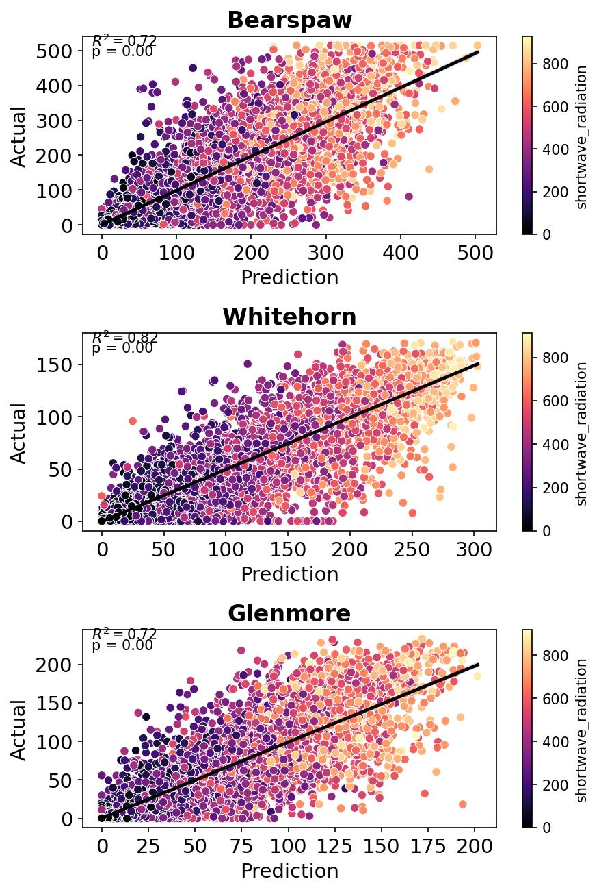
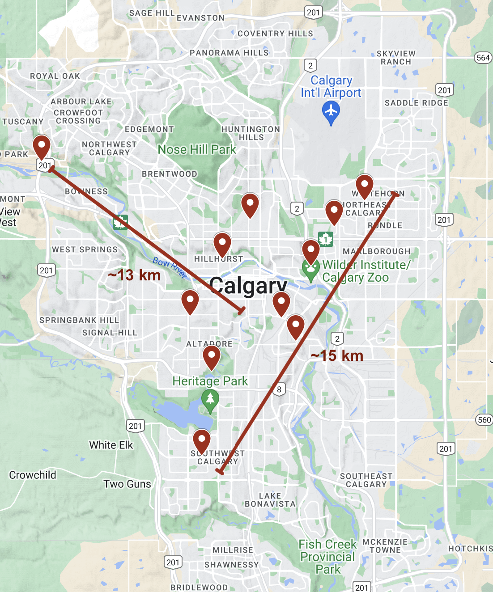
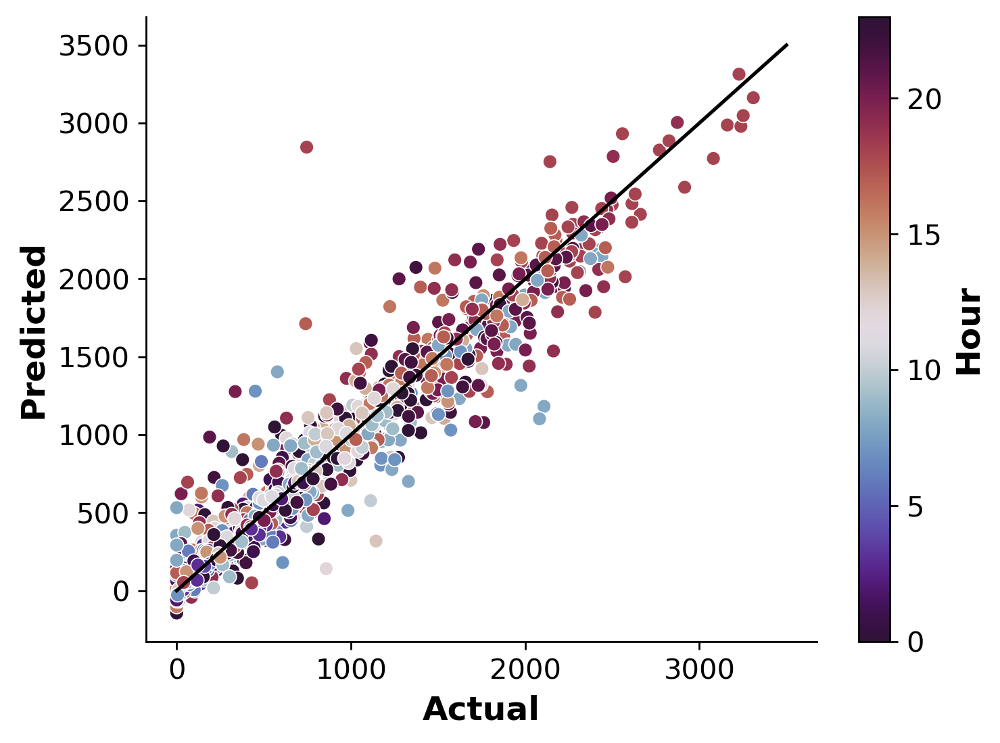

# Mark's ML Portfolio

## [Project 1: Calgary Solar Array Prediction](https://github.com/MarkHague/calgary_solar_production/)

- Built a tool to predict City of Calgary's hourly solar output, providing valuable information to the city's grid operators.
- Achieved an average R2 of 0.79 on the test set, despite inherent limitations of the data (see project page for more details).
- Addressed several issues with the original dataset (e.g. abrupt change in units, dust on the panels).
- Leveraged the OpenMeteo API for training and forecasting data. 
- Added functionality to pull the latest weather prediction and produce a 10-day forecast.
- Identified several potential avenues to improve performance in collaboration with the city.

|||
|:---:|:---:|
| Predicted vs. actual solar output for the 3 largest arrays.| Map of each array location across the city.|

## [Project 2: Seuol Bike Sharing Demand](https://github.com/MarkHague/seoul_bike_sharing_demand)

- Trained a model to predict the number of bikes rented hourly in Seuol, South Korea, helping local government plan for demand.
- Achieved an R2 of 0.93 on the test set using Extreme Gradient Boosted Trees (Linear regression also tested).
- Estimated the optimal set of hyperparamters using GridSearchCV.
- Added a "day of the week" feature, which significantly boosted performance.

[Project 3: Dusty Solar Panel Detection]
